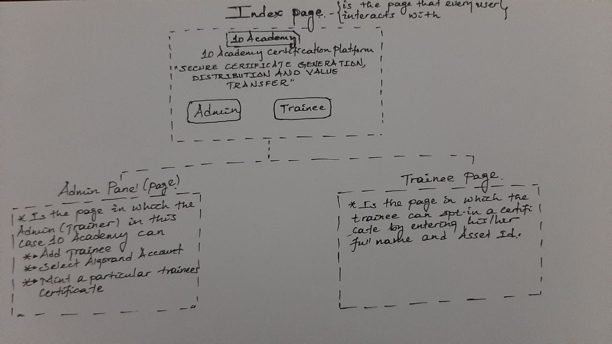
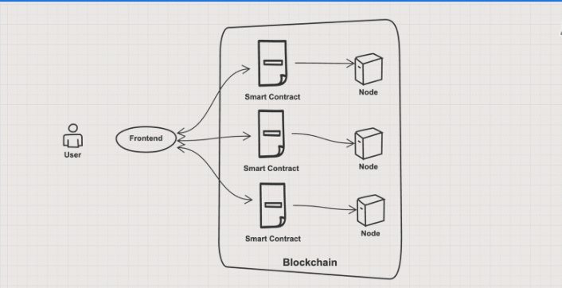

# Certificate-Gen-Dist-Value-Transfer-Algorand
[![Contributors][contributors-shield]][contributors-url]
[![Forks][forks-shield]][forks-url]
[![Stargazers][stars-shield]][stars-url]
[![Issues][issues-shield]][issues-url]

<!-- import an image -->

<!-- Table of contents -->
- [About](#about)
- [Objectives](#objectives)
- [Frontend](#Frontend)
- [Backend](#Backend)
- [Contrbutors](#contrbutors)
- [Contributing](#contributing)
- [License](#license)

## About
Client 10 Academy: wanted to overcome the challenge of ensuring that certificates are available to all trainees in a secure way, and (if possible) that certificate holders can benefit from smart contracts actions now and in the future. Currently, the training certificates are handed to trainees as simple PDF files, which prevents third parties like employers from performing vital steps of authentication.

To systematically tackle this problem 10 Academy has partnered with Algorand to use the Algorand Blockchain as the foundation element of the NFT. Therefore, the main aim of this project is to build an end-to-end Web3 dapp on the Algorand Blockchain which will help 10 Academy to generate and distribute Non-Fungible Tokens(NFTs) as certificates that will represent the successful completion of a weekly challenge to trainees, and allow trainees with NFTs to interact with a smart contract to perform predefined actions.

## Objectives
The major objective behind this types of systems based on the blockchain technology is to enble trust minimizaed and user controlled internet. This project exploits the immutable feature of the blockchain technology to elimainate fraudulent certificate possesions in academic systems. This system will enable 10 Academy to give an NFT based certificate for its trainees after the successful completion of the training program where any one can vertify whether the certificates were obtained legally.

## Frontend
### Frontend Design Concept
The client-side application that the browser fetches from the host server and renders to the user is also called the UI. The UI of a webpage, application, or dapp is the space where user interactions occur. The main objective of a UI is to facilitate a seamless UX, which is achieved by making the interface intuitive and easy to navigate.
Therefore due to time constraints I have decided to make the front end of the application very simple such that it can have two pages where a trainee can opt for an asset in this case the certificate and and admin page where the asset can be minted. 

## Backend
### Backend Design Concept
The functions of databases and other centralized storage locations in web 2 are acquired from the blockchain which enables transactions and applications to be distributed over the network of computers. More specifically, the blockchain acts as a “state machine” which maintains the program state and stability through validating the predefined rules. The state machine is spread between all the participants of a blockchain network and validation is archived through the consensus about program stability.
In this project the backend logic is implemented via smart contracts that will be later deployed to shared state machines(blockchain network). So the backend resides in a peer-to-peer network which consists of individual nodes in the network. The design concept is better in the figure below

## Contrbutors
- Michael Getachew Abebe

## Contributing
Pull requests are welcome. For major changes, please open an issue first to discuss what you would like to change.

Please make sure to update tests as appropriate.

## License
[MIT](https://choosealicense.com/licenses/mit/)

[contributors-shield]: https://img.shields.io/github/contributors/michaelgetachew-abebe/Certificate-Gen-Dist-Value-Transfer-Algorand.svg?style=for-the-badge
[contributors-url]: https://github.com/michaelgetachew-abebe/Certificate-Gen-Dist-Value-Transfer-Algorand/graphs/contributors
[forks-shield]: https://img.shields.io/github/forks/michaelgetachew-abebe/Certificate-Gen-Dist-Value-Transfer-Algorand?style=for-the-badge
[forks-url]: https://github.com/michaelgetachew-abebe/Certificate-Gen-Dist-Value-Transfer-Algorand/network/members
[stars-shield]: https://img.shields.io/github/stars/michaelgetachew-abebe/Certificate-Gen-Dist-Value-Transfer-Algorand.svg?style=for-the-badge
[stars-url]: https://github.com/michaelgetachew-abebe/Certificate-Gen-Dist-Value-Transfer-Algorand/stargazers
[issues-shield]: https://img.shields.io/github/issues/michaelgetachew-abebe/Certificate-Gen-Dist-Value-Transfer-Algorand.svg?style=for-the-badge
[issues-url]: https://github.com/michaelgetachew-abebe/Certificate-Gen-Dist-Value-Transfer-Algorand/issues
[license-shield]: https://img.shields.io/github/license/michaelgetachew-abebe/Certificate-Gen-Dist-Value-Transfer-Algorand.svg?style=for-the-badge
[license-url]: https://github.com/michaelgetachew-abebe/Certificate-Gen-Dist-Value-Transfer-Algorand/blob/master/LICENSE.txt